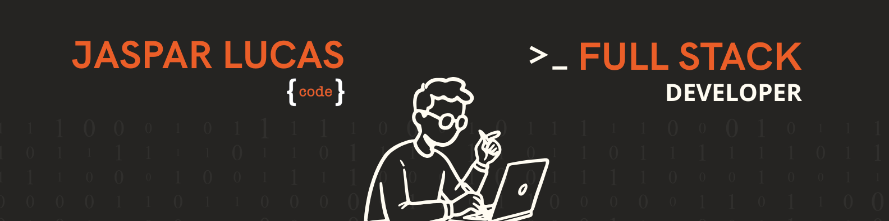

  

# Salut, moi c'est Lucas JASPAR ! 👋

### 👨‍💻 Développeur Web Full Stack | Expert en Écriture Multimédia

Passionné par l'innovation, je conçois et déploie des solutions techniques sur mesure pour aider les entreprises à atteindre leur plein potentiel de croissance. Mon approche combine rigueur technique et réflexion UX.

---

### 🛠️ Mon Stack Technique

**Frontend**
    

**Backend & DB**
    

**Outils & Méthodes**
  

---

### 🌟 Projets & Expériences

- 🎓 **TFE :** Développement d'une application en **Réalité Virtuelle** pour l'apprentissage des langues (HEPL).
- 🏗️ **Stage @ Delomid IT :** Optimisation SEO et création de structures web sur WordPress.
- 🔄 **Stage @ ASBL Aigs :** Refonte UI/UX et analyse de plateforme web.
- 🌱 En apprentissage continu sur **Flutter** et les architectures modernes.

---

### 📊 Statistiques GitHub

---

### 📫 Me contacter

- 💼 [LinkedIn](https://www.linkedin.com/in/lucasjaspar)
- 🌐 [Mon Portfolio](https://www.jasparlucas.be)
- 📧 [jasparlucas@gmail.com](mailto:jasparlucas@gmail.com)

*"Le code est une forme d'écriture multimédia où chaque ligne construit une expérience."*
