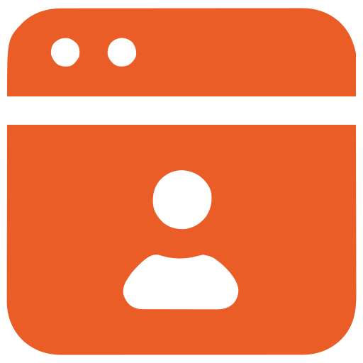
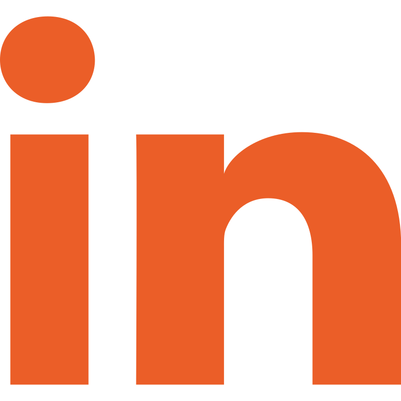

### Développeur Web Full Stack passionné par l'innovation, je conçois et déploie des solutions techniques sur mesure pour aider les entreprises à atteindre leur plein  potentiel de croissance.

---
 
<table align="center" border="0">
  <tr>
    <td align="center" width="80">
      
    </td>
    <td align="center" width="80"> 
    </td>
    <td align="center" width="80">
      
    </td>
  </tr>
</table>

## 🛠️ Mon Stack Technique

### Frontend
&nbsp;&nbsp;&nbsp;&nbsp;&nbsp;&nbsp;&nbsp;&nbsp;&nbsp;
    

### Backend & DB
&nbsp;&nbsp;&nbsp;&nbsp;&nbsp;&nbsp;&nbsp;&nbsp;&nbsp;
    

### Outils & Méthodes
&nbsp;&nbsp;&nbsp;&nbsp;&nbsp;&nbsp;&nbsp;&nbsp;&nbsp;
  

---

## 🌟 Projets & Expériences

- 🎓 **TFE :** Développement d'une application en **Réalité Virtuelle** pour l'apprentissage des langues (HEPL).
- 🏗️ **Stage @ Delomid IT :** Optimisation SEO et création de structures web sur WordPress.
- 🔄 **Stage @ ASBL Aigs :** Refonte UI/UX et analyse de plateforme web.
- 🌱 En apprentissage continu sur **Flutter** et les architectures modernes.

## 📫 Me contacter

- 💼 [LinkedIn](https://www.linkedin.com/in/lucasjaspar)
- 🌐 [Mon Portfolio](https://www.jasparlucas.be)
- 📧 [jasparlucas@gmail.com](mailto:jasparlucas@gmail.com)

